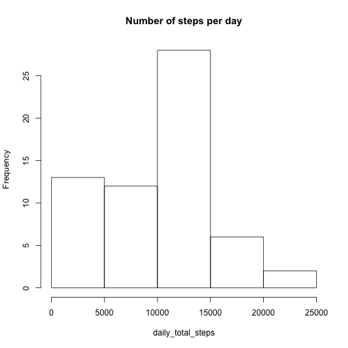
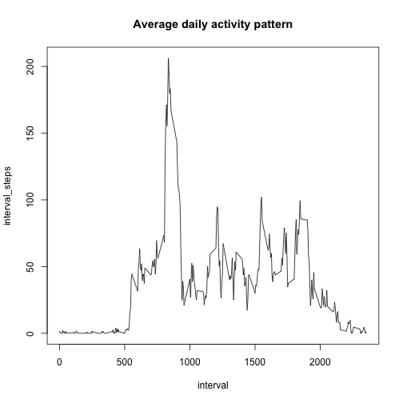
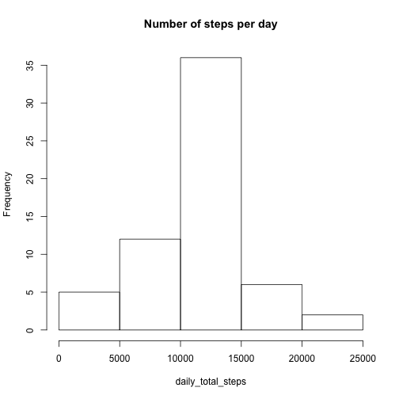
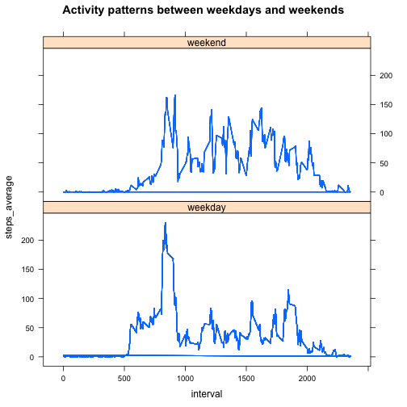

## Loading and preprocessing the data


```r
data<-read.csv("~/RepData_PeerAssessment1/activity.csv")
```

## What is mean total number of steps taken per day?


```r
library(dplyr)
```

```
## 
## Attaching package: 'dplyr'
## 
## The following object is masked from 'package:stats':
## 
##     filter
## 
## The following objects are masked from 'package:base':
## 
##     intersect, setdiff, setequal, union
```

```r
by_date<- group_by(data,date)
steps_by_date<-summarise(by_date, dailysteps = sum(steps, na.rm = TRUE))
daily_total_steps<- as.vector(steps_by_date$dailysteps)
hist(daily_total_steps,main="Number of steps per day")
```

 

```r
mean(daily_total_steps)
```

```
## [1] 9354.23
```

```r
median(daily_total_steps)
```

```
## [1] 10395
```


## What is the average daily activity pattern?

```r
by_interval<- group_by(data,interval)
activity_pattern<-summarise(by_interval, interval_steps = mean(steps, na.rm = TRUE))
plot(activity_pattern,type="l",main="Average daily activity pattern")
```

 

```r
highest<-arrange(activity_pattern,desc(interval_steps))
highest[1,]
```

```
## Source: local data frame [1 x 2]
## 
##   interval interval_steps
## 1      835       206.1698
```
## Imputing missing values

```r
nas<-is.na(data["steps"])
sum(nas)
```

```
## [1] 2304
```

```r
merged_data<-merge(data,activity_pattern,all=TRUE)
merged_data_replaced<-mutate(merged_data,steps_relacement=ifelse(is.na(steps),interval_steps,steps))
new_data2<-select(merged_data_replaced,steps_relacement,date,interval)
new_data1<-rename(new_data2,steps=steps_relacement)
new_data<-arrange(new_data1,date,interval)
by_date<- group_by(new_data,date)
steps_by_date<-summarise(by_date, dailysteps = sum(steps, na.rm = TRUE))
daily_total_steps<- as.vector(steps_by_date$dailysteps)
hist(daily_total_steps,main="Number of steps per day")
```

 

```r
mean(daily_total_steps)
```

```
## [1] 10766.19
```

```r
median(daily_total_steps)
```

```
## [1] 10766.19
```
## Are there differences in activity patterns between weekdays and weekends?

```r
library(lubridate)
new_data_with_day<-mutate(new_data,day=wday(date,label=FALSE),wday_wend=ifelse(day==1|day==7,"weekend","weekday"))
by_interval_day<- group_by(new_data_with_day,interval,wday_wend)
activity_pattern_day<-mutate(by_interval_day, steps_average = mean(steps, na.rm = TRUE))
library(lattice)
activity_pattern_day <- transform(activity_pattern_day, wday_wend = factor(wday_wend))
xyplot(steps_average ~ interval | wday_wend, data = activity_pattern_day, type="l",main="Activity patterns between weekdays and weekends",layout = c(1, 2))
```

 
